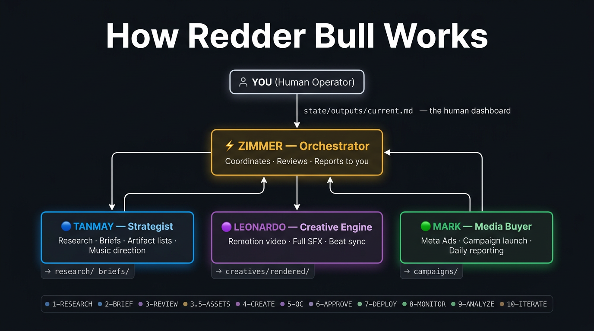

# ⚡ Redder Bull

**Mentos to your marketing.**

An open-source AI marketing agency you can fork, fill in your product context, and let run. Four specialized agents. One orchestrator. No subscription.

[](https://opensource.org/licenses/MIT)
[](https://claude.ai/code)
[](https://remotion.dev)

---

## What It Does

You give it a product. It researches the market, writes creative briefs, produces video ads (with sound design and beat sync), and launches them on Meta. Then it watches the numbers and tells you what's working.

You only get involved when:
- Something needs your approval
- An asset needs to be provided (logo, reference video, background music)
- Budget sign-off is required

Everything else: the agents handle it.

---

## Meet the Team

| Agent | Name | Job |
|---|---|---|
| ⚡ Orchestrator | **Zimmer** | Runs the whole thing. Reviews every deliverable. Reports to you. |
| 🔵 Strategist | **Tanmay** | Market research, competitor analysis, creative briefs. Has opinions. |
| 🟣 Creative Engine | **Leonardo** | Remotion video ads, full SFX, beat-synced to your background track. |
| 🟢 Media Buyer | **Mark** | Meta Ads campaigns. Won't touch your budget without approval. |

They communicate through files, not APIs. No rate limits. No walled gardens. Just markdown.

---

## See It in Action

**[Watch the intro video](https://github.com/kushjain7/redder-bull/raw/main/media/redder-bull_intro.mp4)** — plays in-browser or your default player.  
*(Same file lives at [`media/redder-bull_intro.mp4`](media/redder-bull_intro.mp4) in this repo.)*

> *Leonardo made this video. He wants you to know that.*



---

## Quickstart

```bash
# Clone it
git clone https://github.com/kushjain7/redder-bull.git
cd redder-bull

# Set up the Remotion creative environment
chmod +x setup.sh && ./setup.sh

# Configure your API keys
cp .env.example .env
# → Add your ANTHROPIC_API_KEY + Meta Ads credentials

# Give the agency your product
# Edit state/product-context.md — who you are, what you sell, who buys it

# Start a cycle
# Open Claude Code in this directory, then:
# "You are Zimmer. Start Cycle 1."
```

The output file is `state/outputs/current.md`. That's where Zimmer reports to you throughout the run.

---

## The Pipeline

Every campaign runs through 11 stages:

```
1  RESEARCH     Tanmay     Market scan, competitor ads, audience data
2  BRIEF        Tanmay     3 creative briefs + artifact list + music direction
3  REVIEW       Zimmer     Brief QC — quality, completeness, strategy
3.5 ASSETS      YOU        Zimmer asks for logos, footage, music — you drop the files
4  CREATE       Leonardo   Video ads with full sound design, beat-synced to your track
5  QC           Zimmer     30-point checklist: visual, audio, typography, pacing
6  APPROVE      YOU        You review the creatives + approve the budget
7  DEPLOY       Mark       Campaigns go live on Meta
8  MONITOR      Mark       24–72 hour performance tracking
9  ANALYZE      Zimmer     What worked, what didn't, why
10 ITERATE      Zimmer     Learnings feed the next cycle
```

---

## For Multiple Products

Fork this repo once. Never touch the fork again. For each product:

```bash
cp -r redder-bull/ product-name/
cd product-name/
# Edit state/product-context.md
# Run the agency
```

No cross-contamination. Each directory is a separate agency instance.

---

## Project Structure

```
redder-bull/
├── CLAUDE.md                          ← Shared instructions all agents read
├── setup.sh                           ← One-command environment setup
├── .env.example                       ← API key template
│
├── skills/
│   ├── orchestrator/SKILL.md          ← Zimmer's full playbook
│   ├── marketing/SKILL.md             ← Tanmay's research + brief framework
│   ├── remotion/SKILL.md              ← Leonardo's creative + SFX guide
│   └── meta-ads/SKILL.md             ← Mark's campaign + reporting guide
│
├── state/
│   ├── product-context.md             ← Your product brief (fill this first)
│   ├── current-cycle.md               ← Which cycle, which stage
│   ├── system-log.md                  ← Internal agent log
│   ├── orchestrator-notes.md          ← Zimmer's notes across cycles
│   ├── approvals/pending-approval.md  ← What needs your sign-off
│   └── outputs/
│       ├── current.md                 ← ⭐ The human dashboard — read this
│       ├── FORMAT.md                  ← Zimmer's style guide
│       └── archive/                   ← Previous cycle outputs
│
├── research/                          ← Tanmay's market research outputs
├── briefs/                            ← Creative briefs from Tanmay
├── creatives/
│   ├── remotion-project/              ← Leonardo's Remotion workspace
│   └── review/                        ← Zimmer's creative QC notes
├── campaigns/                         ← Mark's campaign plans + reports
├── tools/
│   └── beat-analyzer.py              ← Audio analysis engine (BPM, drop, phrase)
└── media/
    ├── agency-flow.png                ← Pipeline visual
    └── redder-bull_intro.mp4          ← Agency intro video
```

---

## What Makes This Different

Most AI marketing tools are black boxes. This isn't.

| | Redder Bull | SaaS tools |
|---|---|---|
| See every decision | ✓ (all in markdown files) | ✗ |
| Customize any agent | ✓ (edit SKILL.md) | ✗ |
| Works with your own music/assets | ✓ | Sometimes |
| No monthly subscription | ✓ | ✗ |
| Beat-synced video ads | ✓ | ✗ |
| Runs in Claude Code | ✓ | N/A |

---

## Coming Soon

We're building integrations for when you want higher-quality output and are willing to pay for the tools:

| Tool | Plugs Into | What It Unlocks |
|---|---|---|
| **Higgsfield AI** | Leonardo | Cinematic AI video — avatars, product reveals, motion that Remotion can't do. Real footage-quality output. |
| **Apify + AP5** | **Tanmay, Mark** | **Tanmay:** deep competitor intel — Meta Ad Library scraping, landing pages, spend signals. **Mark:** programmatic hooks into Meta, TikTok, and Google Ads for campaign control and richer reporting. |
| **ElevenLabs** | Leonardo | AI voiceover — narration tracks synced to your video without a recording studio. |

The agency is free. The upgrades are optional. Fork first, upgrade when you're ready.

---

## Requirements

- Claude Code (with an Anthropic API key)
- Node.js 18+ and npm (for Leonardo's Remotion workspace)
- Python 3.8+ (for `tools/beat-analyzer.py`)
- ffmpeg (for audio analysis and conversion)
- Meta Business account + access token (for Mark to run campaigns)
- Pipeboard MCP (for Mark's Meta Ads connection)

---

## License

MIT. Fork it. Ship it. Keep the credits if you're feeling generous.

---

*Built with Claude Code. Zimmer insisted on writing part of this README. We let him.*
